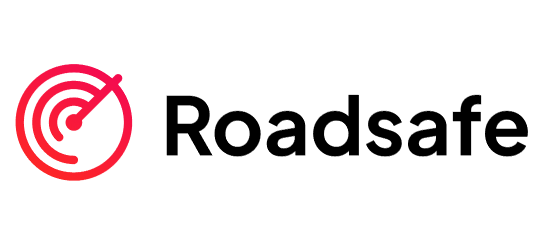
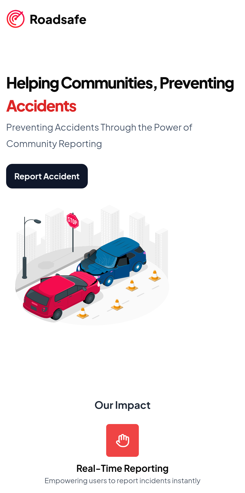
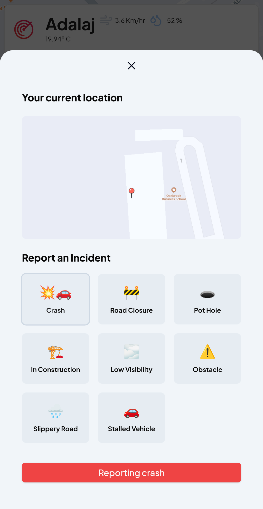
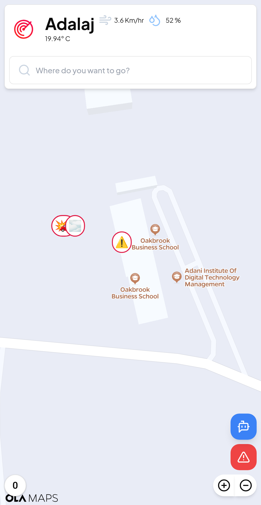
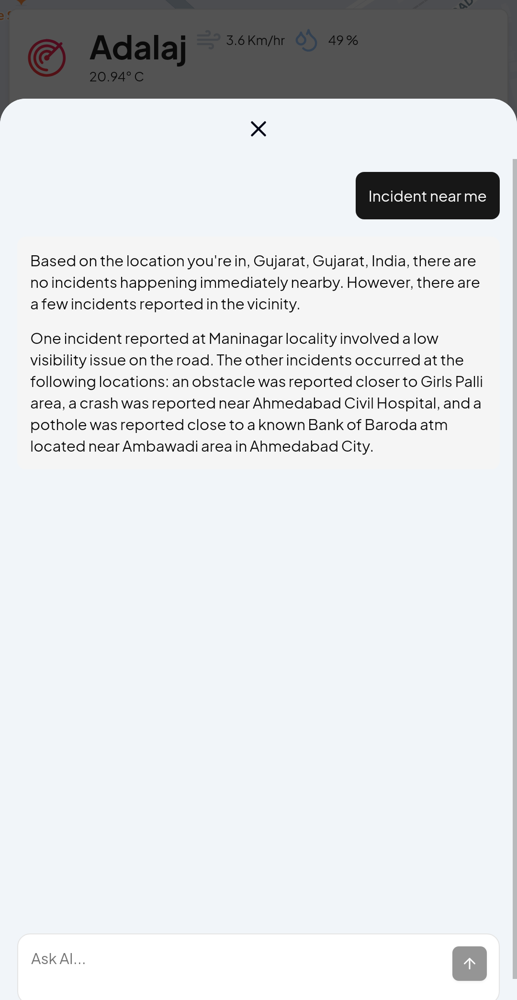

<a name="readme-top"></a>

<!-- PROJECT LOGO -->
<br />
<div align="center">
  <a href="">
  <!--addlink here-->
    
  </a>

  <h3 align="center">Roadsafe</h3>
  <p align="center">
    Accident Prevention through Real-Time Data and Smart Technology
  </p>
</div>

---

## About Roadsafe

Roadsafe is a cutting-edge web application aimed at enhancing road safety by leveraging real-time data, user collaboration, and smart technology. The platform provides users with critical tools and features to prevent accidents and navigate safer routes, making roads safer for drivers and pedestrians alike.



### Key Features

1. **Accident Prevention through Real-Time Data**
   - **Live Traffic Flow Information**: Powered by the TomTom API, Roadsafe provides real-time traffic updates to alert users about congestion and hazardous areas.
   - **Dynamic Hazard Detection**: Integrates live data sources to identify potential risks, including accidents, roadblocks, and adverse weather conditions.

2. **Crowdsourced Hazard Reports**
   - Users can report hazards such as accidents, potholes, or construction zones.
   - All reports contribute to a comprehensive, crowdsourced hazard database for better road safety.

3. **Interactive Map Interface**
   - Utilizes OLA Maps to provide a dynamic, user-friendly map.     
   - Displays hazards and suggests safe routes to help users avoid danger zones.

4. **Smart Notifications**
   - Real-time alerts for accident-prone areas, speeding warnings, and adverse weather conditions.
   - Notifications ensure users make informed and safer decisions while on the road.

5. **Chatbots for Query Assistance**
   - Chatbots powered by Llama and Gemini provide instant responses to user queries about nearby incidents and hazards. Hosted locally and via Cloudflare Workers, the chatbots ensure real-time assistance.

6. **Police Dashboard**
   - Authorities can view incident details, locations, and reporter information through a dedicated interface.
   - Enables marking incidents as resolved, contributing to an efficient hazard management system.

7. **Text-to-Speech Notifications**
   - Users are notified on the go with real-time text-to-speech alerts, enhancing situational awareness.

---

## Built With

- [](https://nextjs.org)
- [](https://www.typescriptlang.org/)
- [](https://www.python.org/)
- [](https://supabase.com/)
- [](https://www.cloudflare.com/)
- [](https://developer.tomtom.com)

<p align="right">(<a href="#readme-top">back to top</a>)</p>

---

## Getting Started

To get a local copy up and running, follow these simple steps.

### Prerequisites

Ensure you have the following installed:
- Node.js
- pnpm

### Installation

1. Clone the repo
   ```bash
   git clone https://github.com/NotTheRightGuy/Roadsafe.git
   ```
2. Install dependencies
   ```bash
   pnpm install

   ```
3. Run the development server
   ```bash
   pnpm run dev

   ```
4. Open [http://localhost:3000](http://localhost:3000) with your browser to see the result.

<p align="right">(<a href="#readme-top">back to top</a>)</p>

---

## User Flow

 **Hazard Reports**
   

### Interactive Map

### Chatbot Map


<p align="right">(<a href="#readme-top">back to top</a>)</p>

---

## Features

- **Real-Time Hazard Detection**: Notify users of accidents, roadblocks, and adverse weather conditions.
- **User-Reported Hazards**: Build a community-driven hazard reporting system.
- **Safe Route Suggestions**: Guide users away from danger zones with route recommendations.
- **Smart Alerts**: Deliver timely warnings about potential risks.
- **Chatbot Assistance**: Get real-time answers about nearby hazards.
- **Police Dashboard**: Allow authorities to manage and resolve reported incidents.
- **Text-to-Speech Notifications**: Provide hands-free, real-time alerts to users.

<p align="right">(<a href="#readme-top">back to top</a>)</p>

---

## Contributing

Contributions are what make the open source community such an amazing place to learn, inspire, and create. Any contributions you make are **greatly appreciated**.

If you have a suggestion that would make this better, please fork the repo and create a pull request. You can also simply open an issue with the tag "enhancement".

1. Fork the Project
2. Create your Feature Branch 
3. Commit your Changes 
4. Push to the Branch 
5. Open a Pull Request

<p align="right">(<a href="#readme-top">back to top</a>)</p>

---

## License

Distributed under the MIT License. See `LICENSE.txt` for more information.

<p align="right">(<a href="#readme-top">back to top</a>)</p>
